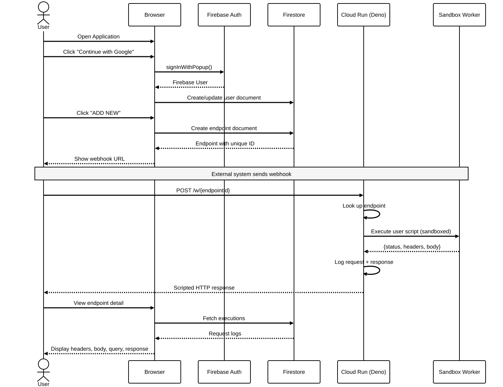

# Hooklab

A webhook testing and debugging platform that lets you create endpoints, inspect incoming HTTP requests in real time, and write custom response scripts -- all from your browser. Built with React, Deno, and Firebase.

---

## Table of Contents

1. [What is Hooklab?](#what-is-hooklab)
2. [Key Features](#key-features)
3. [Quick Start](#quick-start)
4. [Architecture](#architecture)
5. [Data Model](#data-model)
6. [Technology Stack](#technology-stack)
7. [Security](#security)
8. [Project Structure](#project-structure)
9. [Scripts Reference](#scripts-reference)
10. [Firebase Setup](#firebase-setup)
11. [Deployment](#deployment)
12. [Environment Variables](#environment-variables)
13. [DevContainer](#devcontainer)
14. [Contributing](#contributing)
15. [License](#license)

---

## What is Hooklab?

When integrating with third-party APIs, webhooks are often a "black box" -- you configure a URL, wait for a callback, and hope for the best. Hooklab turns that process into a transparent, programmable workflow:

- **Create** a unique webhook endpoint in seconds.
- **Receive** any HTTP request and inspect headers, body, query parameters, and metadata.
- **Script** custom responses with a built-in JavaScript editor that runs in a sandboxed Deno Worker.
- **Replay** and debug requests without re-triggering the source system.

Whether you are prototyping a Stripe integration, debugging a GitHub webhook, or testing an IoT callback, Hooklab gives you full visibility and control.

---

## Key Features

| Feature                    | Description                                                                          |
|----------------------------|--------------------------------------------------------------------------------------|
| **Instant endpoints**      | Create a unique URL (e.g. `https://your-domain/w/{id}`) that accepts any HTTP method |
| **Request inspector**      | View headers, body, query params, and response for every incoming request            |
| **Scriptable responses**   | Write JavaScript to return dynamic responses based on request data                   |
| **Sandboxed execution**    | Scripts run in an isolated Deno Worker with no file, network, or env access          |
| **Real-time updates**      | Auto-refresh mode polls for new requests as they arrive                              |
| **Authentication**         | Google sign-in, anonymous guest mode, and email/password (coming soon)               |
| **Guest mode**             | Try the platform instantly with seeded demo data -- no account required              |
| **Search and filter**      | Search endpoints by name or URL; filter by active/closed status                      |
| **Cloud Functions**        | Server-side operations like bulk deletion and guest data seeding                     |
| **Infrastructure as Code** | Full Terraform modules for GCP, Cloud Run, Firebase Hosting, and custom domains      |

---

## Quick Start

### Prerequisites

| Requirement      | Version   | Notes                                                                                                |
|------------------|-----------|------------------------------------------------------------------------------------------------------|
| **Node.js**      | 22+       | [Download](https://nodejs.org/)                                                                      |
| **npm**          | 10.8.0+   | Comes with Node.js                                                                                   |
| **Firebase CLI** | 13+       | `npm install -g firebase-tools`                                                                      |
| **Java**         | 11+       | Required for Firebase emulators ([SDKMAN](https://sdkman.io/))                                       |
| **Deno**         | 2.1+      | Required for the API server ([Install](https://docs.deno.com/runtime/getting_started/installation/)) |

### 1. Clone and install

```bash
git clone <repository-url>
cd hooklab

# Install all dependencies (root, client, and functions)
npm run install:all
```

### 2. Start the development server

```bash
npm start
```

This starts Firebase emulators and the Vite dev server together. Once running:

| Service         | URL                   |
|-----------------|-----------------------|
| **Application** | http://localhost:5173 |
| **Emulator UI** | http://localhost:4000 |

The Vite dev server proxies `/api/*` and `/w/*` requests to the Deno API server on port 3000.

Behind the scenes, the Firebase emulators run on these ports:

| Emulator   | Port   |
|------------|--------|
| Hosting    | 5002   |
| Functions  | 5001   |
| Auth       | 9099   |
| Firestore  | 8080   |

To start the Deno API server separately:

```bash
deno task dev
```

### 3. Run the tests

```bash
npm test
```

Tests run inside Firebase emulators automatically. See the [Scripts Reference](#scripts-reference) section for more test commands.

### 4. Build for production

```bash
npm run build
```

Output goes to the `client/dist/` directory.

---

## Architecture

### System Overview

Hooklab uses a hybrid architecture: Firebase handles authentication, data storage, and static hosting, while a Deno server on Cloud Run processes incoming webhooks and executes user scripts.

<p align="center">
  
</p>

**How it works:**

1. **Firebase Hosting** serves the Vite-built React SPA via a global CDN. Rewrites route `/api/**` and `/w/**` to Cloud Run.
2. **Firebase Auth** provides Google sign-in and anonymous authentication. The client SDK manages tokens and session state.
3. **Firestore** stores users, endpoints, and execution logs. Security rules enforce ownership and access control.
4. **Cloud Run** hosts the Deno API server (Hono framework) that handles:
   - **Auth routes** (`/api/auth/*`) -- register, login, session validation
   - **Endpoint routes** (`/api/endpoints/*`) -- CRUD for webhook endpoints
   - **Webhook receiver** (`/w/:endpointId`) -- catches any HTTP method, executes user scripts, logs the request
5. **Sandbox Worker** -- user-defined scripts run in an isolated Deno Worker with all permissions revoked (no network, file, or env access) and a 10-second timeout.
6. **Cloud Functions** handle operations like bulk execution deletion and guest data seeding.

### Component Architecture

<p align="center">
  
</p>

### User Journey

<p align="center">
  
</p>

---

## Data Model

The application uses Cloud Firestore with three primary collections.

### Database Structure

```
users/
  {userId}/
    email: string
    isAnonymous: boolean
    displayName: string
    createdAt: timestamp
    lastLoginAt: timestamp
    endpointCount: number
    quotas: {
      maxEndpoints: number        # 3 for guests, 50 for registered
      maxExecutionsPerDay: number  # 100 for guests, 10000 for registered
      usedExecutionsToday: number
    }

endpoints/
  {endpointId}/
    userId: string
    name: string
    script: string
    isActive: boolean
    defaultStatusCode: number     # default 200
    defaultContentType: string    # default "application/json"
    defaultBody: string           # default '{"ok": true}'
    totalExecutions: number
    createdAt: timestamp
    updatedAt: timestamp

executions/
  {executionId}/
    endpointId: string
    userId: string
    method: string                # GET, POST, PUT, DELETE, etc.
    url: string
    headers: map
    query: map
    body: string
    ip: string
    responseStatus: number
    responseBody: string
    timestamp: timestamp
```

### Field Reference

| Collection   | Key Field             | Description                                               |
|--------------|-----------------------|-----------------------------------------------------------|
| `users`      | `quotas.maxEndpoints` | Guest users: 3, registered users: 50                      |
| `endpoints`  | `script`              | User-defined JavaScript executed on each incoming request |
| `endpoints`  | `defaultStatusCode`   | Fallback status when no script is configured              |
| `executions` | `responseStatus`      | HTTP status code returned to the caller                   |
| `executions` | `timestamp`           | When the webhook request was received                     |

---

## Technology Stack

### Frontend

| Technology   | Version   | Purpose                                                       |
|--------------|-----------|---------------------------------------------------------------|
| React        | 19        | UI framework                                                  |
| TypeScript   | 5.7       | Type safety                                                   |
| Vite         | 6.0       | Dev server and build tool                                     |
| Radix UI     | Latest    | Accessible headless components (Dialog, Dropdown, Tabs, etc.) |
| React Router | 7.1       | Client-side routing                                           |
| Sonner       | 1.7       | Toast notifications                                           |
| Lucide React | 0.469     | Icon library                                                  |
| Firebase SDK | 11.2      | Auth, Firestore, Functions                                    |

### Backend (API Server)

| Technology   | Version   | Purpose                                                |
|--------------|-----------|--------------------------------------------------------|
| Deno         | 2.1+      | Runtime with built-in TypeScript and permissions model |
| Hono         | Latest    | Lightweight web framework                              |
| Web Workers  | Built-in  | Sandboxed script execution with revoked permissions    |

### Cloud Functions

| Technology         | Version   | Purpose                         |
|--------------------|-----------|---------------------------------|
| Node.js            | 22        | Runtime                         |
| firebase-functions | 6.2       | Cloud Functions framework       |
| firebase-admin     | 13.0      | Server-side Firebase operations |

### Firebase Services

| Service         | Purpose                                                    |
|-----------------|------------------------------------------------------------|
| Hosting         | Static SPA hosting with global CDN                         |
| Authentication  | Google, anonymous, and email/password auth                 |
| Cloud Firestore | Document database for users, endpoints, and execution logs |
| Cloud Functions | Serverless compute for bulk operations and data seeding    |

### Infrastructure

| Tool          | Purpose                                                                     |
|---------------|-----------------------------------------------------------------------------|
| Terraform     | IaC for GCP project, Cloud Run, Firebase, Artifact Registry, custom domains |
| Docker        | Containerized Deno API server for Cloud Run                                 |
| DevContainers | Reproducible development environment                                        |

### Testing

| Tool                         | Version   | Purpose                        |
|------------------------------|-----------|--------------------------------|
| Vitest                       | 3.0       | Unit and integration tests     |
| Playwright                   | 1.58      | End-to-end tests               |
| Testing Library              | 16.1      | React component testing        |
| @firebase/rules-unit-testing | 4.0       | Firestore security rules tests |
| @vitest/coverage-v8          | 3.0       | Code coverage                  |

---

## Security

The application implements multiple layers of security.

### Firestore Security Rules

Defined in `firestore.rules`:

| Rule                         | Description                                                   |
|------------------------------|---------------------------------------------------------------|
| **Default deny**             | All reads and writes are denied unless explicitly allowed     |
| **Owner-only reads**         | Users can only read their own documents                       |
| **Ownership enforcement**    | Endpoints and executions are scoped to the creating user      |
| **Immutable fields**         | `createdAt` cannot be modified after creation                 |
| **Guest quotas**             | Anonymous users are limited to 3 endpoints                    |
| **Execution write lockdown** | Only Cloud Functions / backend can create execution logs      |
| **Input validation**         | Endpoint names must be non-empty strings under 100 characters |

### Script Sandboxing

User-defined webhook response scripts run in a Deno Worker with all permissions revoked:

| Permission            | Status  |
|-----------------------|---------|
| Network access        | Denied  |
| File system read      | Denied  |
| File system write     | Denied  |
| Environment variables | Denied  |
| Subprocess execution  | Denied  |
| FFI                   | Denied  |
| High-resolution time  | Denied  |

Scripts have a **10-second execution timeout**. If a script fails or times out, the endpoint falls back to its default response configuration.

### HTTP Security Headers

Configured in `firebase.json` and applied by Firebase Hosting:

| Header                 | Value                                    | Purpose                       |
|------------------------|------------------------------------------|-------------------------------|
| X-Content-Type-Options | `nosniff`                                | Prevents MIME type sniffing   |
| X-Frame-Options        | `DENY`                                   | Prevents clickjacking         |
| X-XSS-Protection       | `1; mode=block`                          | Browser XSS filter            |
| Referrer-Policy        | `strict-origin-when-cross-origin`        | Controls referrer information |
| Permissions-Policy     | Disables geolocation, microphone, camera | Restricts browser APIs        |

### API Server Security

- **CORS** is configured to allow only specific origins (`localhost:5173`, `localhost:3000`).
- **JWT-based auth middleware** protects all `/api/endpoints/*` routes.
- **Webhook receiver** (`/w/*`) is intentionally public -- it must accept requests from any external system.

---

## Project Structure

```
hooklab/
  README.MD                        # This file
  package.json                     # Root scripts (emulators + test orchestration)
  firebase.json                    # Firebase project configuration
  firestore.rules                  # Firestore security rules
  firestore.indexes.json           # Firestore composite indexes
  .firebaserc                      # Firebase project aliases (default, staging, production)
  Dockerfile                       # Deno API server container for Cloud Run

  client/                          # React frontend
    package.json                   #   Frontend dependencies and scripts
    vite.config.ts                 #   Vite + Vitest configuration
    vitest.setup.ts                #   Test setup file
    .env.development               #   Dev environment (emulator mode)
    .env.production                #   Production Firebase config template
    src/
      App.tsx                      #   Router, auth provider, route guards
      index.css                    #   Global styles
      context/
        AuthContext.tsx             #   Firebase auth state management
      lib/
        firebase-init.ts           #   Firebase SDK initialization + emulator wiring
        firestore.ts               #   Firestore CRUD operations (endpoints, users, executions)
        api.ts                     #   TypeScript type definitions
      pages/
        landing/
          LandingPage.tsx          #   Marketing / call-to-action page
        auth/
          AuthPage.tsx             #   Login page (Google, Apple, Email, Guest)
        dashboard/
          DashboardPage.tsx        #   Endpoint listing with search and filters
          EndpointDetail.tsx       #   Request inspector (headers, body, query, response)
          ScriptEditor.tsx         #   JavaScript editor with API reference and test runner
      components/
        ui/                        #   Reusable UI primitives (shadcn/ui style)
        webhook/                   #   Domain-specific components (cards, filters, header, footer)
      __tests__/                   #   Test files

  server/                          # Deno API server
    main.ts                        #   Server entry point (Hono app)
    deno.json                      #   Deno configuration and tasks
    routes/
      auth.ts                      #   Register, login, session endpoints
      endpoints.ts                 #   Endpoint CRUD + request log endpoints
      webhooks.ts                  #   Webhook receiver (catch-all handler)
    middleware/
      auth.ts                      #   JWT verification middleware
    services/
      store.ts                     #   In-memory data store
      script-runner.ts             #   Sandboxed Deno Worker script execution
    workers/
      sandbox.worker.ts            #   Isolated worker for user script execution

  functions/                       # Firebase Cloud Functions
    src/                           #   Function implementations
    package.json                   #   Function dependencies (Node.js 22)
    tsconfig.json                  #   TypeScript configuration
    vitest.config.ts               #   Function test configuration

  terraform/                       # Infrastructure as Code
    main.tf                        #   Root module (APIs, module wiring)
    variables.tf                   #   Input variables
    outputs.tf                     #   Output values
    terraform.tfvars.example       #   Example variable values
    modules/
      firebase/                    #   Firebase project + Firestore + Artifact Registry
      hosting/                     #   Firebase Hosting site
      cloud-run/                   #   Cloud Run service for Deno API
      domain/                      #   Custom domain mapping
      service-accounts/            #   IAM service accounts + Workload Identity Federation

  .devcontainer/                   # Development container
    devcontainer.json              #   Container features, ports, VS Code extensions
    docker-compose.yml             #   Service definition (app + volumes)
    Dockerfile                     #   Dev container base image
    post-create.sh                 #   One-time setup (dependencies, shell config, aliases)

  .github/                         # CI/CD workflows
```

---

## Scripts Reference

### Development

| Command                                                   | Description                                          |
|-----------------------------------------------------------|------------------------------------------------------|
| `npm start`                                               | Start Vite dev server + Firebase emulators           |
| `npm run serve`                                           | Start Firebase emulators only (no Vite)              |
| `npm run build`                                           | Production build to `client/dist/`                   |
| `npm run install:all`                                     | Install all dependencies (root + client + functions) |
| `devcontainer up`                                         | Start development container                          |
| `devcontainer exec claude --dangerously-skip-permissions` | Run Claude Code in the container                     |

### Testing

| Command                           | Description                                                  |
|-----------------------------------|--------------------------------------------------------------|
| `npm test`                        | Run all tests (client + functions) inside Firebase emulators |
| `npm run test:watch`              | Run client tests in watch mode with emulators                |
| `npm run test:coverage`           | Generate code coverage report                                |
| `npm run test:rules`              | Run Firestore security rules tests only                      |
| `npm run test:functions`          | Run Cloud Functions tests only                               |
| `cd client && npm test`           | Run client unit tests directly                               |
| `cd client && npm run test:watch` | Run client tests in watch mode                               |
| `cd functions && npm test`        | Run function tests directly                                  |

### Shell Aliases (DevContainer)

| Alias          | Command                  |
|----------------|--------------------------|
| `dev-client`   | Start Vite dev server    |
| `dev-server`   | Start Deno API server    |
| `fb-emulators` | Start Firebase emulators |
| `install-all`  | Install all dependencies |

---

## Firebase Setup

### Local Development (Emulators)

No Firebase project is needed for local development. The app uses the `demo-webhook` project ID with Firebase emulators.

1. Install the Firebase CLI:

   ```bash
   npm install -g firebase-tools
   ```

2. Start the emulators:

   ```bash
   npm run serve
   ```

   The client is pre-configured to connect to emulators when `VITE_FIREBASE_USE_EMULATORS=true` (set in `client/.env.development`).

### Production Firebase Project

1. Create a Firebase project at [console.firebase.google.com](https://console.firebase.google.com).

2. Enable the following services:
   - **Authentication** -- enable Google sign-in and Anonymous providers
   - **Cloud Firestore** -- create a database (production mode)
   - **Cloud Functions** -- requires Blaze (pay-as-you-go) plan
   - **Hosting** -- create a site

3. Update `.firebaserc` with your project IDs:

   ```json
   {
     "projects": {
       "default": "demo-webhook",
       "staging": "your-staging-project",
       "production": "your-production-project"
     }
   }
   ```

4. Copy and fill in production environment variables:

   ```bash
   cp client/.env.production client/.env.production.local
   ```

   Update the values from your Firebase project settings (Project Settings > General > Your apps > Web app).

5. Deploy Firestore rules and indexes:

   ```bash
   firebase deploy --only firestore:rules,firestore:indexes --project your-project
   ```

6. Deploy Cloud Functions:

   ```bash
   cd functions && npm run build
   firebase deploy --only functions --project your-project
   ```

---

## Deployment

### Docker (Cloud Run)

The Deno API server is packaged as a Docker container for Cloud Run:

```bash
# Build the container
docker build -t hooklab-api .

# Run locally
docker run -p 8080:8080 hooklab-api
```

The `Dockerfile` runs Deno with minimal permissions:
- `--allow-net` -- serve HTTP requests
- `--allow-env` -- read PORT and configuration
- `--allow-read` -- load server source files
- `--unstable-worker-options` -- enable sandboxed Workers for script execution

### Terraform (Infrastructure)

The `terraform/` directory contains modules for provisioning the full GCP infrastructure:

```bash
cd terraform

# Copy and edit variable values
cp terraform.tfvars.example terraform.tfvars

# Initialize and plan
terraform init
terraform plan

# Apply
terraform apply
```

**What Terraform provisions:**

| Resource | Module |
|----------|--------|
| GCP APIs (Firebase, Cloud Run, IAM, etc.) | Root |
| Firebase project + Firestore + Artifact Registry | `modules/firebase` |
| Firebase Hosting site | `modules/hosting` |
| Cloud Run service (Deno API) | `modules/cloud-run` |
| Custom domain mapping | `modules/domain` |
| Service accounts + Workload Identity Federation | `modules/service-accounts` |

### Firebase Hosting

```bash
# Deploy static client
npm run build
firebase deploy --only hosting --project your-project
```

### Production Checklist

Before deploying to production, verify:

- [ ] Firebase Auth providers enabled (Google, Anonymous)
- [ ] Firestore rules deployed from `firestore.rules`
- [ ] Cloud Functions deployed and tested
- [ ] Cloud Run service deployed with correct environment variables
- [ ] Firebase Hosting headers configured in `firebase.json`
- [ ] Terraform state backend configured (GCS bucket)
- [ ] Custom domain DNS records in place
- [ ] `client/.env.production` populated with real Firebase config

---

## Environment Variables

### Client (`client/.env.development`)

| Variable | Default | Description |
|----------|---------|-------------|
| `VITE_FIREBASE_API_KEY` | `demo-key` | Firebase API key |
| `VITE_FIREBASE_AUTH_DOMAIN` | `localhost` | Firebase auth domain |
| `VITE_FIREBASE_PROJECT_ID` | `demo-webhook` | Firebase project ID |
| `VITE_FIREBASE_STORAGE_BUCKET` | -- | Firebase storage bucket (production only) |
| `VITE_FIREBASE_MESSAGING_SENDER_ID` | -- | FCM sender ID (production only) |
| `VITE_FIREBASE_APP_ID` | -- | Firebase app ID (production only) |
| `VITE_FIREBASE_USE_EMULATORS` | `true` | Connect to local Firebase emulators |

### Server

| Variable | Default | Description |
|----------|---------|-------------|
| `PORT` | `3000` (dev) / `8080` (Docker) | HTTP server port |

---

## DevContainer

The project includes a fully configured development container for consistent environments.

### What is included

- **Deno** runtime (via base image)
- **Node.js 22** + npm
- **Java 21** (for Firebase emulators)
- **Firebase CLI**
- **Google Cloud CLI**
- **GitHub CLI**
- **Docker-outside-of-Docker** (for container tooling)
- **Claude Code** (AI assistant)

### VS Code Extensions (auto-installed)

| Extension | Purpose |
|-----------|---------|
| Deno | Deno language support for `server/` |
| Prettier | Code formatting |
| ESLint | JavaScript/TypeScript linting |
| Docker | Dockerfile support |
| VSFire | Firebase rules syntax highlighting |

### Getting Started with DevContainer

```bash
# Start the container
devcontainer up

# Open a shell
devcontainer exec bash

# Or run Claude Code directly
devcontainer exec claude --dangerously-skip-permissions
```

The container automatically:
1. Installs all npm dependencies (root, client, functions) in parallel
2. Configures shell aliases for common tasks
3. Sets up git with safe directory and useful aliases
4. Forwards all required ports (API, Vite, emulators)

---

## Contributing

1. Fork the repository
2. Create a feature branch: `git checkout -b feature/your-feature`
3. Make your changes and commit with conventional commit messages
4. Ensure all checks pass: `npm test`
5. Push to your fork and open a Pull Request

**Requirements:**

- All tests must pass
- Firestore security rules tests must pass
- TypeScript must compile without errors
